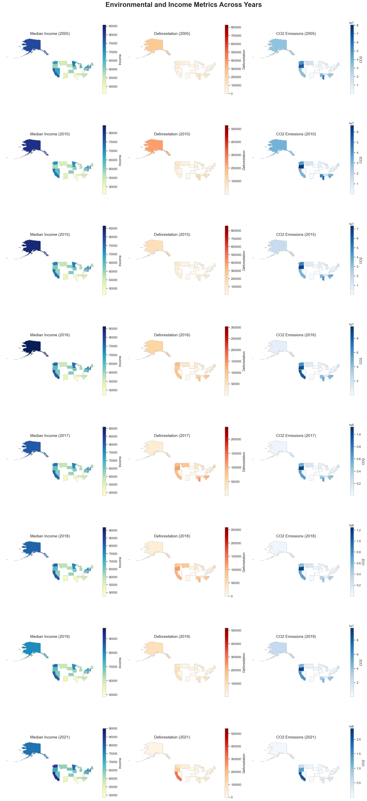

# Analysis of median household income and environmental impact metrics, deforestation and $CO_2$ emissions across U.S. states

This project implements an ETL (Extract, Transform, Load) pipeline that combines US state-level income data from the National Center for Education Statistics (NCES) with deforestation and CO₂ emissions data from Global Forest Watch (GFW). The pipeline processes and merges these datasets to facilitate analysis of the relationship between income levels and environmental factors across US states.

The pipeline extracts data from online sources, performs necessary transformations and cleanups, and loads the merged dataset into a SQLite database for further analysis. This tool is designed for researchers, policymakers, and data analysts interested in exploring the connections between economic indicators and environmental changes at the state level in the United States.



## Repository Structure

```
.
├── project
│   ├── data_report.md
│   ├── ETL
│   │   ├── extract.py
│   │   ├── load.py
│   │   └── transform.py
│   ├── pipeline.py
│   ├── pipeline.sh
│   ├── project-plan.md
│   ├── test.py
│   └── tests.sh
└── README.md
```

### Key Files:
- `project/pipeline.py`: Main entry point for the ETL pipeline
- `project/ETL/extract.py`: Handles data extraction from NCES and GFW sources
- `project/ETL/transform.py`: Performs data cleaning and transformation
- `project/ETL/load.py`: Loads processed data into SQLite database
- `project/test.py`: Contains unit tests for the pipeline
- `project/tests.sh`: Shell script to run the test suite

## Usage Instructions

### Prerequisites
- Python 3.11
- project/requirements.txt

### Installation

1. Clone the repository:
   ```
   git clone <repository_url>
   cd <repository_local_name>
   ```

2. Install required Python packages:
   ```
   pip install -r project/requirements.txt
   ```

### Running the Pipeline

To execute the ETL pipeline:

```bash
cd project
./pipeline.sh
```

This will download the latest data from NCES and GFW, process it, and store the results in a SQLite database.

### Running Tests

To run the test suite:

```bash
cd project
./tests.sh
```

### Configuration

The pipeline uses the following data sources by default:
- NCES Income Data: https://nces.ed.gov/programs/digest/d22/tables/xls/tabn102.30.xlsx
- GFW Deforestation Data: https://gfw2-data.s3.amazonaws.com/country-pages/country_stats/download/2023/USA.xlsx

To modify these sources, update the URLs in `project/pipeline.py`.

### Troubleshooting

Common issues and solutions:

1. Data Download Failures
   - Problem: Unable to download data from NCES or GFW URLs
   - Solution: 
     1. Check your internet connection
     2. Verify the URLs in `project/pipeline.py` are still valid
     3. If URLs have changed, update them in the code

2. Database Creation Issues
   - Problem: SQLite database is not created after running the pipeline
   - Solution:
     1. Ensure you have write permissions in the project directory
     2. Check if SQLite is installed and functioning on your system
     3. Verify the database path in `project/ETL/load.py`

### Debugging

To enable debug logging:

1. Open `project/pipeline.py`
2. Locate the logging configuration section
3. Change `level=logging.INFO` to `level=logging.DEBUG`
4. Run the pipeline again to see detailed debug output

Log files are stored in `etl_pipeline.log` in the project directory.

## Data Flow

The ETL pipeline processes data through the following steps:

1. Extraction:
   - Downloads NCES income data and GFW deforestation data from specified URLs
   - Saves raw data as Excel files

2. Transformation:
   - Cleans NCES income data by removing unnecessary rows and columns
   - Processes GFW data to extract relevant deforestation and CO₂ emission information
   - Merges cleaned income and environmental data based on state-level information

3. Loading:
   - Creates an SQLite database
   - Loads the merged and transformed data into the database

```
[NCES Data] --> [Extract] --> [Clean Income Data] --\
                                                     \
[GFW Data]  --> [Extract] --> [Clean GFW Data]   ---> [Merge Data] --> [Load to SQLite]
```


Notes:
- The pipeline ensures data consistency by aligning years between income and environmental data
- Error handling and logging are implemented throughout the pipeline.
- Further data and correlation analysis is in ```project/report.ipynb```