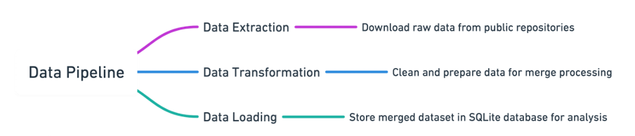

### **1. Question**

**Main Question**:  
Is there a significant relationship between median household income and environmental impacts—such as deforestation and CO₂ emissions—across U.S. states?

This project tries to establish a correlation between some socio-economic conditions, measured by median household income, and influence environmental impact. Using the correlation analysis, the project wants to examine the relationship between income levels and ecological indicators, such as deforestation and CO₂ emissions; therefore, the study intends to disclose some insights into the interplay between socioeconomic conditions and environmental sustainability.

---

### **2. Data Sources**

#### **Datasource 1: Digest of Education Statistics**
- **Description**:  
  The dataset provides median household income at the state level for selected years from 1990 to 2021. This data is essential for understanding income variations across U.S. states over time, offering the socioeconomic dimension required for the analysis. The granular, state-level data facilitates meaningful comparisons between income and environmental conditions.
  
- **Source Details**:  
  - **Metadata URL**: [Digest of Education Statistics](https://nces.ed.gov/programs/digest/)
  - **Data URL**: [Median Household Income Data](https://nces.ed.gov/programs/digest/d22/tables/xls/tabn102.30.xlsx)
  - **Data Type**: Excel spreadsheet
  
- **License**: 
The data source for this file was compiled from:
U.S. Department of Commerce, Census Bureau:
  - "Median Household Income in 1989," selected years from 2010 through 2019, retrieved November 20, 2020, from [https://data.census.gov/cedsci/table?q=B19013&tid=ACSDT1Y2019.B19013](https://data.census.gov/cedsci/table?q=B19013&tid=ACSDT1Y2019.B19013).

The table was prepared in November 2020.

---

#### **Datasource 2: Global Forest Watch (GFW)**
- **Description**:  
This dataset is from selected years, starting in 1990 and going to 2021, giving median household income at the state level. Such data is quintessential in understanding the variation of income across U.S. states over time and provides the socioeconomic dimension of analysis needed. Such granular state-level data enable meaningful comparisons between income and environmental conditions.

- **Source Details**:  
  - **Metadata URL**: [Global Forest Watch](https://www.globalforestwatch.org/)
  - **Data URL**: [GFW Data XLSX](https://gfw2-data.s3.amazonaws.com/country-pages/country_stats/download/2023/USA.xlsx)
  - **Data Type**: Excel spreadsheet
  
- **License**:  
  Creative Commons CC provides the dataset BY 4.0 licensing.  
  - [GFW Data License](https://data.globalforestwatch.org/pages/data-policy)

---

This dataset includes elaborate statistics on deforestation, tree cover loss, and CO₂ emissions due to land-use changes. These statistics can capture critical environmental metrics required for assessing the impact of socio-economic factors on state-level deforestation and related emissions in the United States.

### **3. High-Level Data Pipeline Description**

#### Technologies Used

- **Python**: The main language of pipeline implementation.
- **Libraries**:
  - **pandas**: For data manipulation
  - **sqlite3**: For database operations
  - **requests**: Downloading data
  - **os** for file management.
  - **zipfile** for handling compressed files.
- **SQLite**: Due to the database's simplicity and conversion, it is also portable.

#### Transformation and Cleaning Steps

##### Cleaning of Data:
- Removed unnamed columns and invalid rows, such as empty or summary rows from both the income and deforestation datasets. 
- Standardized naming of columns across the datasets. 
- Retained columns for income across multiple years (1990–2021), relevant for analysis.
- Ensured matching year columns in both datasets for smooth joining.

##### Data Transformation:
- Retained only state-level data.
- Merged deforestation and income data based on a standard State column.
- Missing value handling: rows with null entries were dropped to maintain data integrity.

##### Normalization:
- Standardized column naming across the dataset.
- Filtered columns are irrelevant to the analysis.

#### Issues Arisen and Their Solutions
- Some states needed more data for specific years. Thus, any rows with missing values were dropped to allow for accurate comparisons.
- It is addressed by renaming columns during the cleaning and transformation steps.
- Environmental data used long column names, while income data abbreviated their years. We are standardizing column names to resolve this.
There is a mismatch in the years between the datasets. We must align the available columns to only common years.
- Checked against null values and dropped them to ensure clean datasets.
- Modularity using Python function for downloading, cleaning, and transforming datasets.

#### **4. Result and Limitations**

##### Output Data
- **Structure**: A merged dataset with columns representing the state, yearly income, deforestation (tree cover loss), and CO₂ emissions.
- **Format**: Stored in a SQLite database (`analysis.db`) with a table named `US_Analysis`.
- **Quality**: Null values and redundant columns removed; datasets are aligned by state and year.

##### Output Data Format
- **Database**: SQLite was chosen for its portability and ease of integration with analysis workflows.

##### Reflections on data
1. **Data Quality**:
   - Reliable data sources to ensure good data quality.
   - Limitations can bee potential biases in data recording and collection as well as state-level aggregation.

2. **Issues for Final Report**:
   - **Misalignment**: Median Income and deforestation trends may not be directly comparable.
   - **Assumptions**: Dropping rows with null values may reduce representativeness of the dataset.